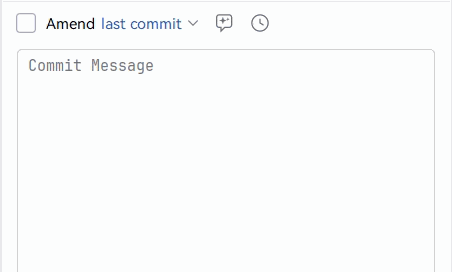

# GitEmojiForJetbrains

JetBrains IDE Git Commit Emoji 前缀插件。在 Commit 工具窗口提供工具栏按钮，选择模板后自动生成 `feat ✨: ` 格式的 commit 前缀。



## 功能

- **Commit 工具窗口工具栏按钮**：点击弹出模板列表
- **模板选择弹窗**：展示 emoji + type + name（如 `✨ feat - 引入新功能`）
- **覆盖输入框**：选择后覆盖 commit message 输入框，光标移到末尾
- **设置页面**：`Settings → Tools → Git Emoji Commit`
  - 自定义格式模板（占位符 `${emoji}`、`${type}`、`${name}`、`${description}`）
  - 模板列表增删改（emoji、type、name、description 四列可编辑）
  - 恢复默认按钮
  - 应用级存储，所有项目共享配置

## 默认模板（18 条）

| emoji | type | name | description |
|-------|------|------|-------------|
| ✨ | feat | 引入新功能 | 新功能 |
| 🐛 | fix | 修复bug | BUG |
| 🚀 | perf | 提高性能/优化 | 优化 |
| 🎨 | refactor | 改进/重构代码 | 优化 |
| 🥚 | format | 格式化代码 | 格式化 |
| 🚑 | patch | 添加重要补丁 | 补丁 |
| 💄 | style | 更新样式文件 | 样式 |
| 📚 | docs | 添加/更新文档 | 文档 |
| 🔧 | chore | 日常维护 | 杂项 |
| 🧩 | deps | 修改依赖版本 | 依赖 |
| 🔁 | revert | 还原之前的提交 | 回滚 |
| 🧪 | test | 增加测试代码 | 测试 |
| 📦 | file | 添加新文件 | 新文件 |
| 📌 | tag | 发布版本/添加标签 | 书签 |
| 🔧 | config | 修改配置文件 | 配置 |
| ⚙️ | ci | Action持续集成相关修改 | 持续集成 |
| 🙈 | git | 添加或修改.gitignore文件 | 不可见 |
| 🎉 | init | 初次提交/初始化项目 | 初始化 |

默认格式模板：`${type} ${emoji}: `

## 构建

```bash
./gradlew buildPlugin
```

输出插件 zip 在 `build/distributions/` 下。

## 开发调试

```bash
./gradlew runIde
```

启动沙箱 IDE，在 Commit 工具窗口测试按钮功能。

## 技术栈

- Kotlin + Gradle Kotlin DSL
- IntelliJ Platform Gradle Plugin 2.x
- JDK 21（编译目标 21）
- 目标 IDE：IntelliJ IDEA 2024.2+

## 参考

参考 VS Code 插件 [git-commit-lint-vscode](https://github.com/UvDream/git-commit-lint-vscode)
